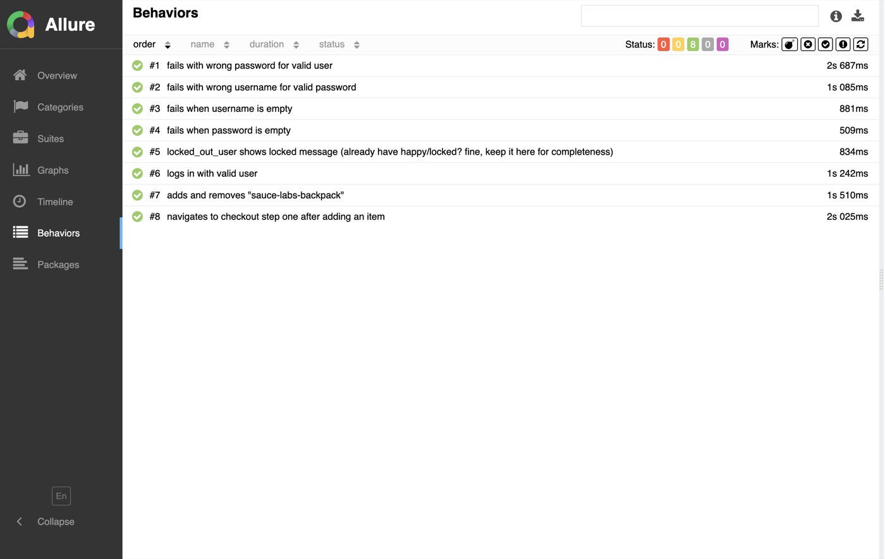

# Test Automation Portfolio (Cypress + Allure)
[](https://github.com/NedaRostami/test-automation-portfolio/actions/workflows/ui-tests.yml)


> **Sample Allure report (Behaviors)**
 

**Stack:** Cypress 15, Allure, GitHub Actions, ESLint/Prettier  
**Scope:** UI (Sauce Demo), API (reqres), Reporting, CI

---

## Structure
cypress/
e2e/
auth/
login.cy.js
login-negative.cy.js
cart/
add-item.cy.js
checkout-path.cy.js
api/
users.smoke.cy.js
pages/
fixtures/
support/
e2e.js
cypress.config.js
docs/
images/
allure-behaviors.png


---

## Scripts

- `npm run cy:open` — run Cypress in interactive mode  
- `npm run cy:run` — run headless  
- `npm run report:gen` — generate Allure HTML report (`./allure-report`)

---

## Run locally

```bash
# install deps (CI-friendly)
npm ci

# run tests
npm run cy:open     # interactive
npm run cy:run      # headless


## Allure
npm run report:gen       # generate html -> ./allure-report
npx http-server allure-report -o   # Allure HTML

```


## CI
- Headless Chrome on Ubuntu
- Artifacts:
  - Allure HTML (download from workflow run → Artifacts)
  - Cypress videos on failure (Artifacts)


## Test Matrix

| Area | Spec | What it covers |
|------|------|----------------|
| Auth | `auth/login.cy.js` | happy path login |
| Auth | `auth/login-negative.cy.js` | wrong user, wrong pass, empty user/pass, locked user |
| Cart | `cart/add-item.cy.js` | add/remove by data-test, badge count |
| Cart | `cart/checkout-path.cy.js` | proceed to checkout step one |
| API  | `api/users.smoke.cy.js` | reqres smoke: list single/create/update/delete |

## Links
- [Workflow runs](../../actions)
- [Allure docs](https://docs.qameta.io/allure/)
- [Cypress docs](https://docs.cypress.io/)
